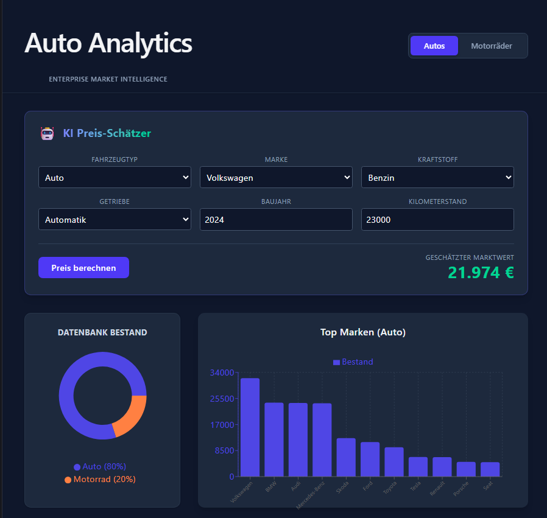
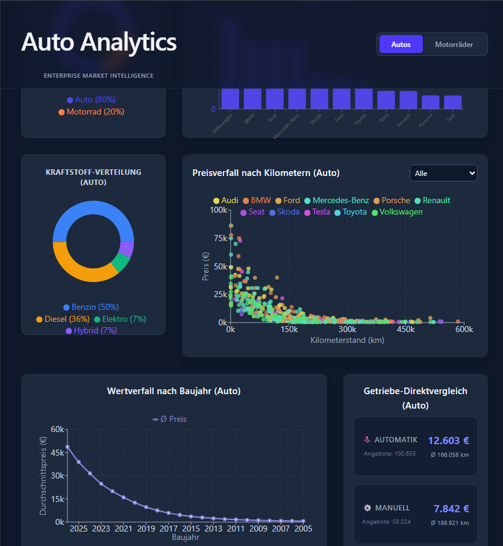
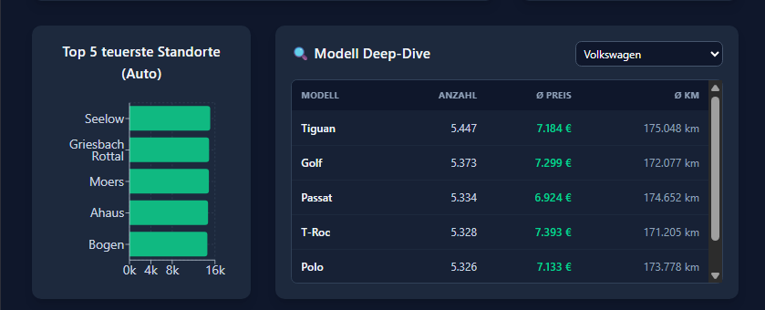

# Used Vehicle Analytics & Prediction Platform

Ein iterativ aufgebautes End-to-End Data Engineering und Full-Stack Projekt. 
Ziel dieses Projekts ist es, eine Plattform für Gebrauchtfahrzeuge zu erschaffen, die zwei Kernfunktionen vereint:
1. **Business Intelligence (BI) Dashboard:** Datengetriebene Analysen, Durchschnitte und Marktverteilungen.
2. **Machine Learning Price Predictor:** Ein ML-Modell, das aus den historischen Daten lernt, um faire Fahrzeugpreise vorherzusagen.

Das Projekt demonstriert den gesamten Lebenszyklus von Daten: Von der Generierung und Speicherung (ETL/PostgreSQL) über das Machine-Learning-Training (Scikit-Learn) bis hin zur Bereitstellung via API (FastAPI) und der Visualisierung in einem modernen React-Dashboard.

## Dashboard Preview

*Die Web-Anwendung bietet ein dynamisches Dashboard mit interaktiven Filtern (Auto/Motorrad), das in Echtzeit mit dem Python-Backend kommuniziert.*

> **Oben:** Der KI Preis-Schätzer (Random Forest Modell), der Fahrzeugbewertungen in Echtzeit liefert. **Unten:** Bestandsübersicht und Top-Marken.

> **Datenanalyse:** Kraftstoffverteilung, Wertverlust über die Jahre und ein Scatter-Plot zum Preisverfall nach Kilometern pro Marke.

> **Detail-Ansicht:** Die teuersten Standorte und eine Deep-Dive Tabelle für spezifische Fahrzeugmodelle.

---

## Tech Stack & Tools

**Data Engineering & Infra:**
* **Data Processing:** Python (Pandas, Numpy, Faker)
* **Database & Bridge:** PostgreSQL, SQLAlchemy, Psycopg2
* **Infrastruktur & Containerisierung:** Docker, GitHub
* **Environment Management:** uv (Virtual Environments)

**Backend & Machine Learning:**
* **Backend API:** FastAPI (Python), Uvicorn
* **Machine Learning:** Scikit-Learn (Random Forest Regressor), Joblib

**Frontend:**
* **Framework:** React (Vite)
* **Styling & UI:** TailwindCSS, Glassmorphism Design
* **Charts:** Recharts

---

## Projekt-Fortschritt (Roadmap)

### Phase 1: Data Engineering & Database 
- [x] Python-Skript zur Generierung von 200.000 realistischen Gebrauchtwagen & Motorrädern gebaut (`Faker`).
- [x] Logische Datenstrukturen und Abhängigkeiten (Wertverlust vs. Alter/KM) im Datengenerator verankert.
- [x] PostgreSQL Datenbank als Docker-Container aufgesetzt.
- [x] Python ETL-Pipeline implementiert, die Rohdaten bereinigt, transformiert (lowercase Schema) und in die DB lädt.
- [x] Datenintegrität via SQL in VS Code überprüft.

### Phase 2: Backend & API-Entwicklung 
- [x] FastAPI Projekt initialisiert und strukturiert.
- [x] Datenbank-Anbindung (SQLAlchemy Engine) im Backend integriert.
- [x] **Analytics-Endpunkte** gebaut (z.B. `/api/stats/marken` für Marktanteile, `/api/stats/preis-kilometer` für Scatter-Plots).
- [x] **Prediction-Endpunkt** vorbereitet (`/api/predict`), der Fahrzeugdaten an das Modell weitergibt.

### Phase 3: Data Science & Machine Learning 
- [x] Daten aus PostgreSQL in Pandas DataFrames geladen.
- [x] Feature Engineering (One-Hot-Encoding) & Modell-Training (Random Forest) durchgeführt.
- [x] Validierung des Modells (Erfolgreiches Lernen der zugrundeliegenden Wertverlust-Muster).
- [x] Abspeichern des Modells (`joblib`/`.pkl`) und nahtlose Einbindung in die FastAPI.

### Phase 4: Frontend & UI 
- [x] Modernes React-Projekt mit Vite und TailwindCSS aufgesetzt.
- [x] **Dashboard-Ansicht:** Interaktive Recharts-Graphen zur Marktanalyse basierend auf den API-Daten (inkl. Cross-Filtering für Autos/Motorräder).
- [x] **KI-Rechner-Ansicht:** Ein interaktives Formular, das die ML-Preiseinschätzung live vom Backend abfragt (inkl. dynamischer Dropdowns zur Fehlervermeidung).
- [x] UI/UX-Refactoring (Full-Width Layout, Sticky Header, saubere Legenden).

---

## Lokales Setup (How to run)

1. **Repository klonen:**
   `git clone https://github.com/Ugur515/used-vehicle-analytics.git`
2. **Virtuelle Umgebung aktivieren & Pakete installieren:**
   `uv pip install pandas sqlalchemy psycopg2-binary faker fastapi uvicorn scikit-learn joblib`
3. **PostgreSQL Docker-Container starten:**
   `docker run --name auto-postgres -e POSTGRES_PASSWORD=meingeheimespasswort -p 5432:5432 -d postgres`
4. **Daten generieren & in DB laden (ETL):**
   `python daten_generator.py`
   `python etl_pipeline.py`
5. **Machine Learning Modell trainieren:**
   `python train_model.py`
6. **Backend starten (im Ordner `backend`):**
   `uvicorn main:app --reload`
7. **Frontend starten (im Ordner `frontend`):**
   `npm run dev`
